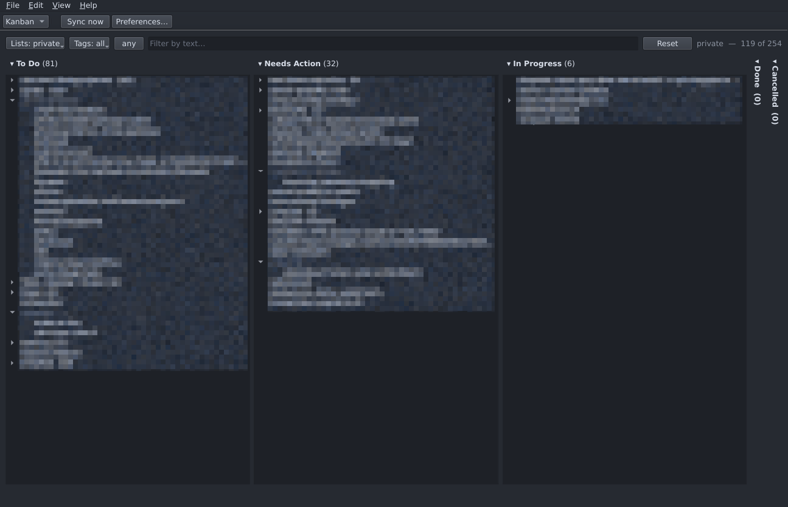

# DavPunk

**Work it. Sync it. Check it. Done.**

A power-user CalDAV VTODO client for Linux (Wayland-primary, X11 compatible).
Syncs with CalDAV servers — primarily [Radicale](https://radicale.org/) — caches
everything offline in SQLite, and optionally exposes an MCP server so an AI
agent can read and manipulate tasks. The UI targets information density and
keyboard-driven workflows.

[HLD.md](HLD.md) is the design authority; the tests assert it.



> [!IMPORTANT]
> **Back up your task collections first, and try `davpunk sync --dry-run`
> before the real thing.**
>
> DavPunk writes to your real calendars. It has run daily for months without a
> slip, but this is version 0.1.0 and only Radicale has been tested hard. The
> [dry run](#trying-a-sync-without-doing-it) shows every request and every
> cached row a sync would touch, and writes neither.

**Here:** [What it is for](#what-davpunk-is-for) · [Requirements](#requirements) ·
[Install](#install) · [First run](#first-run) · [A tour](#a-tour) ·
[Running it](#run) · [Development](#development) · [Contributing](#contributing)

**Elsewhere:** [Using DavPunk](docs/guide.md) · [Passwords and keys](docs/credentials.md) ·
[Nix](docs/nix.md) · [MCP](docs/mcp.md) · [Design](HLD.md) · [Security](SECURITY.md)

## What DavPunk is for

CalDAV has no board in it — a `VTODO` has a `STATUS`, a `RELATED-TO` and not
much else. DavPunk draws a kanban board over task collections it does not own.
Four ideas follow from that, and they explain most of the design:

- **The storage is the standard; the board is a view.** Your server holds plain
  VTODO. Columns map onto `STATUS` and live in your config, so a phone that has
  never heard of DavPunk reads and writes the same tasks.
- **Interoperability over features.** A resource DavPunk did not change comes
  back byte-identical. Where the format has no room for something, DavPunk goes
  without rather than inventing a property only it can read.
- **Never lose data, never decide for you.** Edited in two places? You get both
  versions and a choice, not a winner picked by a timestamp.
- **Offline-first, keyboard-first.** Every edit hits the local cache
  immediately; the network is never in the interaction path.

It is not Trello, Vikunja or Nextcloud Deck — no swimlanes, assignees,
attachments or sharing. Those belong to tools that own their storage, and
DavPunk would rather not own yours.

[Kanban over CalDAV](https://blog.0x17.de/post/davpunk-kanban-over-caldav/) is
the longer version.

**Next up:** ordering on `X-APPLE-SORT-ORDER` instead of the private
`X-DAVPUNK-ORDER`, real recurring-task support (`RRULE` is round-tripped today,
not supported), reminders with the app closed, and testing against servers
other than Radicale.

## Requirements

| | |
|---|---|
| Python | ≥ 3.11 |
| SQLite | ≥ 3.35, built with FTS5 |
| tz data | the system database, or the `tzdata` wheel |
| A place for passwords | either `gpg` on `PATH` with a running `gpg-agent`, **or** a Secret Service (gnome-keyring, KWallet, KeePassXC). Chosen per account — see [Passwords and keys](docs/credentials.md). |

`davpunk doctor` checks every one of these individually, so a machine that is
missing two things tells you about both on the first run.

## Install

### Nix

```sh
nix run github:0x17de/davpunk              # just run the UI
nix profile install github:0x17de/davpunk
```

The flake also ships a headless package for a server that only runs the sync
daemon, a NixOS module, a Home Manager module and an overlay —
[docs/nix.md](docs/nix.md) has them.

### uv

```sh
uv sync --all-extras      # everything
uv sync                   # CLI and daemon only — no Qt, no MCP
uv sync --extra ui        # add the desktop UI
uv sync --extra mcp       # add the MCP server
```

The UI and the MCP server are **extras** on purpose: a headless machine running
only the sync daemon should not need Qt installed.

## First run

Launch `davpunk` with no config and the first-run wizard opens: account
details, where to keep the password, and a password prompt. Every field has a
`?` beside it — hover for what it means and what happens if you get it wrong.
That is the whole setup.

Afterwards it all lives in **Edit → Preferences**, and a second account is the
same dialog again.

DavPunk writes `~/.config/davpunk/config.toml` itself, mode 0600, through
`tomlkit` — so if you ever do open it, your comments and layout survive the
next time Preferences saves. [docs/credentials.md](docs/credentials.md) is the
reference behind the password question: the two places a credential can live,
and how to name a GPG subkey that will still decrypt tomorrow.

## A tour

Both views are trees — a story, the tasks that make it up, and subtasks under
those. **Tab** makes the selected task a subtask of the one above it,
**Shift+Tab** promotes it back out, and on the board you can drag a card onto
another to do the same: it becomes a subtask *and* moves to that card's column.

The columns are yours. They map onto `STATUS`, you decide how many there are,
and a column you are not working in folds to a spine at the right edge — one
line wide, still a drop target for its whole height, which makes `Done` easier
to hit folded than open.

Filter by list, tag and text at once from the bar above the board. The count
beside it says how much of the collection you are looking at.

When your phone and your desktop have both edited a task, DavPunk shows you the
two versions field by field and lets you pick — per field, or all of one side.
It never guesses.

[docs/guide.md](docs/guide.md) has the rest: capturing a list of subtasks in one
go, moving tasks between calendars, deleting a subtree, and what becomes of
finished work.

## Changing settings later

Everything from the wizard is editable at any time under **Edit → Preferences**:
accounts, the encryption key, the password, the default view, and which
permissions the MCP server exposes. **Help → Run diagnostics** is `davpunk
doctor` without leaving the app.

Configuration is read once at startup, so changes take effect on the next
start — DavPunk will not reconfigure a sync that is already running.

## Run

```sh
davpunk                      # the UI (single instance; --new-instance to override)
davpunk sync [--remote ID]   # one sync cycle, then a summary
davpunk status               # per-remote: last sync, pending / blocked / conflicts
davpunk conflicts            # list open conflicts (resolution is a UI action)
davpunk forget ID            # drop an orphaned account and its cached tasks
davpunk doctor [--fix]       # every runtime assumption, checked
davpunk-sync                 # the background sync daemon
davpunk-mcp                  # the MCP server (all capabilities off by default)
```

### Removing an account

Removing an account in **Edit → Preferences** does **not** remove its cached
tasks. DavPunk hides it rather than purging it, so a change of mind — or a
typo, if you were editing the file — cannot cost you data. `davpunk status`
keeps listing it as `[orphaned]`, with whatever error it last saw.

To get rid of it for good, once you are sure:

```sh
davpunk forget ox-privat      # prompts, and asks you to type the id back
davpunk forget ox-privat --yes
```

It refuses an account that is still configured, since every process re-creates
its configured remotes at startup and it would simply come back.

### Trying a sync without doing it

```sh
davpunk sync --dry-run [--remote ID] [--limit N]
```

It reports every request it *would* send to your server and every row it
*would* change in your cache, and writes neither. **File → Preview sync…** is
the same thing in the UI, with a *Sync now* button if you like what you see.

```
ox: 8 calendar(s)
  to the server: 2 request(s)
    CREATE Buy milk           (/dav/ox/einkaufen/a1b2.ics, 412 bytes)
    UPDATE Fix the gate       (/dav/ox/haus/c3d4.ics, 508 bytes)
  to the local cache: 12 new, 3 updated, 0 removed, 1 conflict(s)
    new      Bagger ausleihen
    upd      Regentonne  [summary, due_value]
    CONFLICT Kraut und Rüben
```

The read side is real — discovery, ETags and resource fetches all happen — so a
wrong password, a vanished collection or an unparseable task shows up in a dry
run exactly as it would in a real one. What it cannot predict is how the server
answers a write it never sent: an ETag collision or a quota rejection is only
knowable by writing.

Two things make the promise structural rather than a matter of remembering to
check a flag: the CalDAV client is wrapped so `PUT` and `DELETE` cannot reach
the network, and the cycle runs against a throwaway copy of the database, so
your real cache is never opened for writing. It is otherwise the *same* code
path as `davpunk sync` — the same runner, the same engine — rather than a
second implementation that could drift.

If a collection is skipped because its ctag has not moved, the report says so.
"Nothing to do" and "I did not look" must not read the same.

### Background syncing

```sh
./systemd/install.sh
```

The daemon is the **only** thing that syncs on a timer. The UI does not sync by
itself: it polls the local cache so it shows what the daemon pulls in, but it
contacts a server only when you ask it to — *Sync now*, `Ctrl+R`, or *File →
Preview sync…*. Without the daemon installed, nothing reaches your server until
you press something.

The daemon can only work while it can read your passwords: `gpg-agent` still
holding the passphrase, or the login keyring still open. It never forces a
pinentry and never unlocks the keyring — it skips the cycle, warns once an
hour, and the UI says "credentials locked". `davpunk doctor` tells you when
that is the problem.

`loginctl enable-linger` makes this worse for both backends rather than better:
a daemon running with no login session has no warm agent, no unlocked keyring,
and often no session bus at all.

#### Excluding an account

Untick **Automatic sync** for that account, in the wizard or under **Edit →
Preferences** — `auto_sync = false`, if you happen to be reading the config
file. The daemon then leaves that account alone; *Sync now*, `davpunk
sync` and MCP `sync_now` all still work on it, because those are things you
asked for. `davpunk status` marks such an account `[manual only]`, so a
months-old "last sync" does not read as a fault.

### MCP

DavPunk can expose your tasks to an AI agent over the Model Context Protocol —
twelve tools, every capability **off by default**. A disabled tool is absent
rather than present-and-refusing, so an agent never burns a turn discovering it
is not allowed. Switch it on in **Edit → Preferences → AI access**.

[docs/mcp.md](docs/mcp.md) covers the tools, the two transports, bearer tokens
and how a task is addressed.

## Development

```sh
nix develop          # Qt, Radicale, gpg and every dependency, already wired up
pytest               # the whole suite
pytest -m radicale   # only the tests that spawn a real Radicale
ruff check src tests
mypy                 # needs PySide6 present — see below
nix flake check      # builds both packages and lints
```

Or with uv, if you would rather not use Nix:

```sh
uv sync --all-extras
uv run pytest
uv run ruff check src tests
uv run mypy
```

The Qt tests run offscreen (`QT_QPA_PLATFORM=offscreen`, which the dev shell
sets for you) and skip themselves when PySide6 cannot initialise, so the rest of
the suite runs on a machine with no display. Outside the dev shell PySide6 needs
`libGL` and friends on `LD_LIBRARY_PATH`; inside it, that is handled.

> [!NOTE]
> Both of those checks go quiet rather than loud when PySide6 is missing — the
> Qt tests skip, and mypy, finding no stubs, reads every Qt call as `Any` and
> passes `davpunk.ui` without looking at it. **Run them somewhere Qt actually
> imports**, or they will agree with you about code neither of them read —
> `nix develop` is the short way to be sure.

The suite passes on both dependency sets it is expected to meet — Python 3.12
with `mcp` 2.x under uv, and Python 3.14 with `mcp` 1.x from nixpkgs. Python
3.11 is the floor `pyproject.toml` declares, and it passes too.

## Notable implementation choices

Two deviations from the plan's suggested dependency list, both deliberate:

- **`requests` rather than the `caldav` library.** The sync protocol needs
  direct control over `If-None-Match`, `If-Match`, the `Location` header,
  per-href statuses inside a 207, and `calendar-multiget` batching — none of
  which the higher-level abstraction exposes.
- **`jeepney` rather than `dbus-python`.** `dbus-python` needs a C toolchain and
  `pkg-config` for `dbus-1`; `jeepney` is pure Python and speaks the same
  `org.freedesktop.Notifications` interface. There is a `notify-send` fallback
  behind it.

## Contributing

Contributions are very welcome — and so is simply telling me what you would
like DavPunk to do. Open an issue with a rough idea; that is often the fastest
route to something good, and I enjoy the conversation.

[HLD.md](HLD.md) is where behaviour is written down. It is long, and nobody
expects you to have read it — describe what you would like to change and we
will sort out the design side together.

A few practical things:

- `pytest`, `ruff check src tests` and `mypy` are the checks that run.
  `.pre-commit-config.yaml` wires up all three, so you do not have to remember
  them; its mypy hook runs from your own environment, which is what keeps it
  honest about the Qt code. There is no CI yet — please run them before you
  open a pull request.
- When behaviour changes, HLD.md changes with it. Say the word if you would
  like a hand with that part.
- Commit messages say *why*. Length is welcome.

For bugs, `davpunk doctor` output and the name of your server go a long way —
plus a `--dry-run` report if a sync is involved.

## Code assistants

DavPunk was built with the help of AI code assistants, and it is worth saying
so plainly.

The workflow was design-first: [HLD.md](HLD.md) describes how DavPunk should
behave, the code follows it, and the test suite checks that it does. Writing
the design down first is what made the assistants genuinely useful — there was
always something concrete to build against, and the tests answer whether the
result matches.

Contributions written the same way are just as welcome.

## Security

Found something? [SECURITY.md](SECURITY.md) has where to send it — privately,
please — along with what DavPunk does and does not treat as a boundary.

## Licence

MIT — see [LICENSE](LICENSE).
